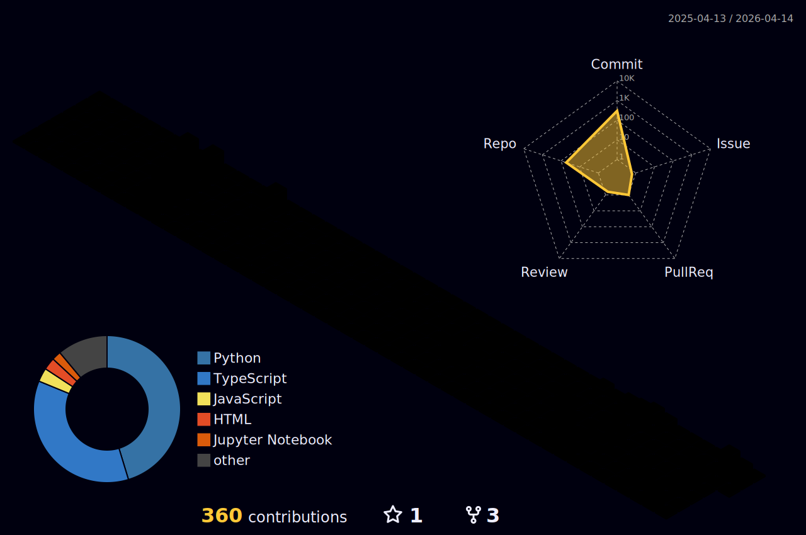

<div align="center">
  
</div>

<div align="center">

<a href="https://readme-typing-svg.demolab.com">
  
</a>

<br/>

<a href="https://linkedin.com/in/aman-singh-a1404b256">
  
</a>
&nbsp;
<a href="https://twitter.com/amnsn_16">
  
</a>
&nbsp;


</div>

<br/>

---

<div align="center">

```
$ darwin --whoami

  ╭──────────────────────────────────────────────────────╮
  │                                                      │
  │   Aman Singh                   Bangalore, India 🇮🇳   │
  │   AI/ML Engineer · Full-Stack Developer              │
  │                                                      │
  │   Research    DARWIN · HELIOS · PHANTOM              │
  │   Building    Self-improving AI systems              │
  │   Stack       LangGraph · FastAPI · Next.js          │
  │   Status      [████████████░░░] ships relentlessly   │
  │                                                      │
  ╰──────────────────────────────────────────────────────╯
```

</div>

- 🧬 Building code agents that **improve themselves** via autonomous self-play and Direct Preference Optimization — no human labels, no reward models
- 🌌 Researching **test-time compute scaling** with MCTS and Process Reward Models (o1-style reasoning)
- 👻 Designing **federated RAG** with differential privacy — distributed retrieval where raw data never leaves the client
- 🤖 Production depth with **LangGraph, CrewAI, LangChain** — multi-agent orchestration at scale
- ⚡ Full-stack: **FastAPI → PostgreSQL → Next.js → Docker → Kubernetes**

---

## 🔬 Research Trilogy

<div align="center">

<table>
  <tr>
    <td width="33%" valign="top" align="center">
      <br/>
      
      <br/><br/>
      <a href="https://github.com/AMANSINGH1674/Darwin">
        
      </a>
      <br/><br/>
      <p align="left">A code agent that teaches itself to write better code — zero human input. Generator plays against a Claude-powered Critic. The winner pair trains the next generation via DPO + LoRA.</p>
      <br/>
      
      
      
    </td>
    <td width="33%" valign="top" align="center">
      <br/>
      
      <br/><br/>
      <div align="left" style="padding: 0 8px">
        <p><strong>o1-style test-time compute scaling.</strong></p>
        <p>Runs Monte Carlo Tree Search over candidate reasoning chains. A Process Reward Model scores each step — not just the final answer — so compute is spent on paths that are actually going somewhere.</p>
      </div>
      <br/>
      
      
      
    </td>
    <td width="33%" valign="top" align="center">
      <br/>
      
      <br/><br/>
      <div align="left" style="padding: 0 8px">
        <p><strong>Federated RAG with differential privacy.</strong></p>
        <p>Distributed knowledge retrieval across isolated nodes. Each client contributes to a shared embedding space — with DP noise injected before aggregation so raw data never leaves its origin.</p>
      </div>
      <br/>
      
      
      
    </td>
  </tr>
</table>

</div>

---

## 🚀 Featured Projects

<div align="center">
<table>
  <tr>
    <td width="50%" align="center">
      <a href="https://github.com/AMANSINGH1674/A.R.T.I.S.T">
        
      </a>
      <br/>
      <sub>🧠 Enterprise Agentic LLM · RLHF · RAG · RBAC · Prometheus/Grafana</sub>
    </td>
    <td width="50%" align="center">
      <a href="https://github.com/AMANSINGH1674/Semantic-Powered--MLES_Platform">
        
      </a>
      <br/>
      <sub>⚗️ ML Engineering Platform · MLflow · Docker Orchestration</sub>
    </td>
  </tr>
  <tr>
    <td width="50%" align="center">
      <a href="https://github.com/AMANSINGH1674/Orchestrix">
        
      </a>
      <br/>
      <sub>🎯 TypeScript Orchestration · Next.js App Router · Edge-ready</sub>
    </td>
    <td width="50%" align="center">
      <a href="https://github.com/AMANSINGH1674/SwiftVisa-AI-Based-Visa-Eligibility-Screening-Agent">
        
      </a>
      <br/>
      <sub>🛂 AI Visa Screening Agent · LangChain · FastAPI</sub>
    </td>
  </tr>
</table>
</div>

---

## 🧬 Tech Stack

<div align="center">

**Languages**


<br/><br/>

**AI / ML**


<br/><br/>

**Infrastructure**


<br/><br/>

**Data & Storage**


</div>

---

## 📊 GitHub Stats

<div align="center">


&nbsp;


<br/><br/>


</div>

---

## 🌊 Activity

<div align="center">
  
</div>

<div align="center">
  <picture>
    <source media="(prefers-color-scheme: dark)"  srcset="https://raw.githubusercontent.com/AMANSINGH1674/AMANSINGH1674/output/github-snake-dark.svg"/>
    <source media="(prefers-color-scheme: light)" srcset="https://raw.githubusercontent.com/AMANSINGH1674/AMANSINGH1674/output/github-snake.svg"/>
    
  </picture>
</div>

<div align="center">
  <picture>
    <source media="(prefers-color-scheme: dark)"  srcset="./profile-3d-contrib/profile-night-rainbow.svg"/>
    <source media="(prefers-color-scheme: light)" srcset="./profile-3d-contrib/profile-green-animate.svg"/>
    
  </picture>
</div>

---

<div align="center">

*"The best code is the code that doesn't need to exist — and the second best is the code that's too elegant to delete."*

<br/>


</div>
